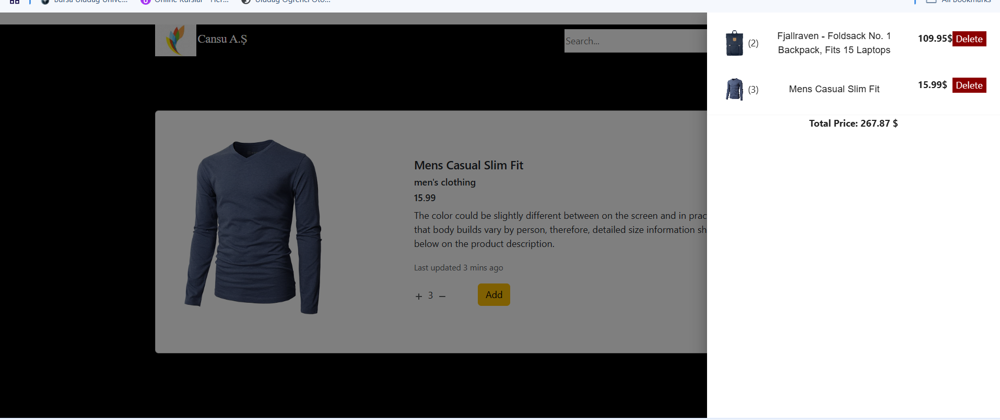

# React ile e-Ticaret Sitesi Uygulaması

- State yönetimi için React redux toolkit kullanılmıştır. 
- Bootstrap, react-icons, material-ui kullanılarak responsive tasarım gerçekleştirilmiştir.
- Route işlemleri için react-router-dom kullanılmıştır.
- Http istekleri için axios kullanılmıştır.
- Material-ui Drawer ile sepet içerisindeki ürünlerin detayları ve toplam tutar gösterilmiştir. 
- Arka plan için karanlık ve aydınlık seçenekleri menu kısmına eklenmiştir
- Ürün verilerini çekebilmek amacıyla "Fake Store API" kullanılmıştır.

Root klasörüne proje için gerekli bağımlılıkları indirebiirsiniz
`npm install @reduxjs/toolkit react-redux`
`npm install react-router-dom`
`npm install @mui/material @emotion/react @emotion/styled`

